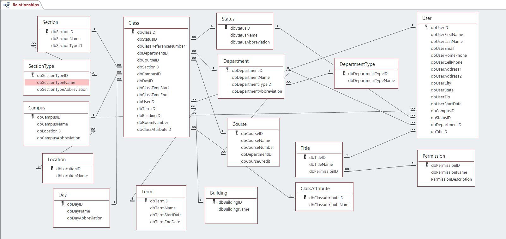
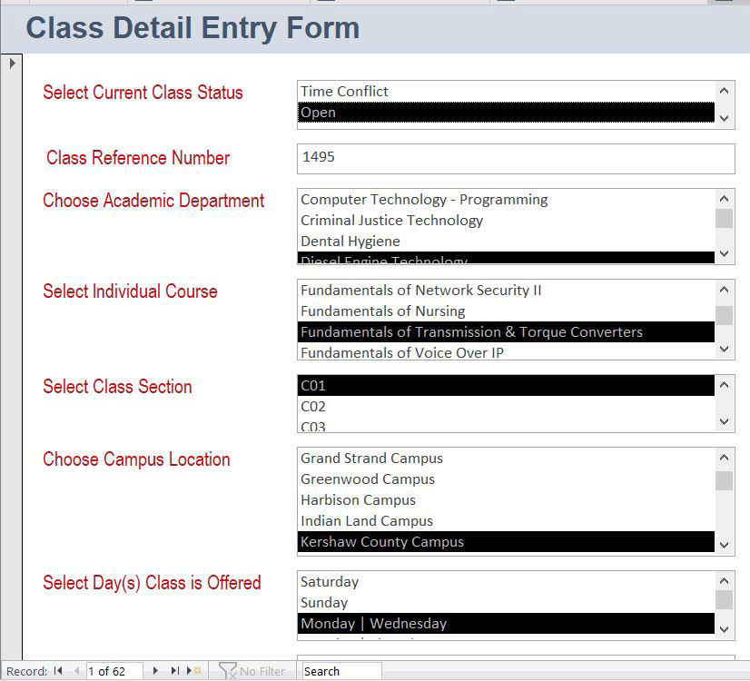
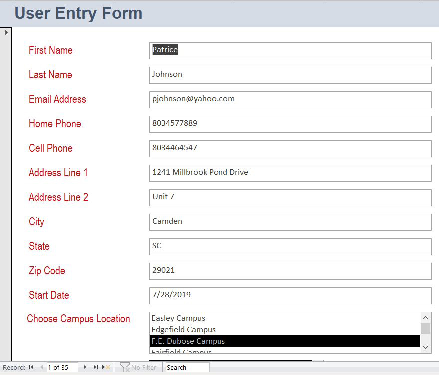
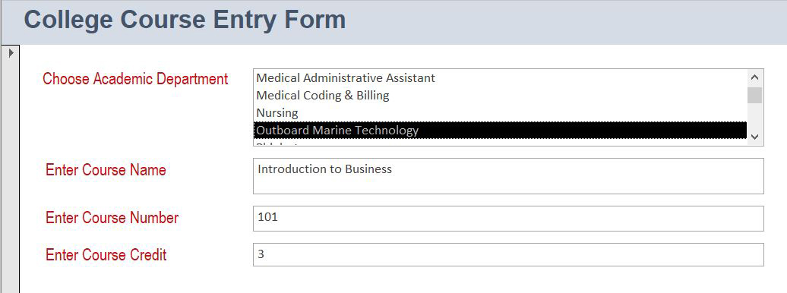
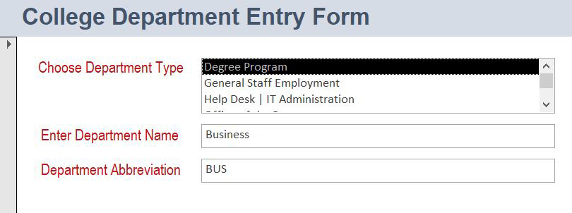

# SC Technical College Database Management System

## Description

This project involved the design and implementation of an updated database management system for the *SC Technical College* educational network. This features a RDBMS created in the MS Access and MySQL Workbench environments, housing all of the required data for the schools specified. A total of 11 college profiles were created, each allowing the permissible user to manage student & teacher data records, update curriculum information, and run reports as necessary. This focuses solely on the back-end area of development, primarily concentrating on the full database framework, which will eventually evolve into a front-end interface.
>Click here for [Project Documentation](school_database.pdf)

## Technical Specifications
### Programming Languages | Environments

* SQL
* MS Access
* MySQL Workbench

## Program Walkthrough: A Brief Summary
### Screenshots
*Entity-Relationship Diagram shown below for the final database framework built initially within the MS Access environment.*  
<!---->

 

*Forms were also created to manage data entry. Examples shown below include user, course info, and department entry form details.*  
&nbsp;&nbsp;&nbsp;
  
&nbsp;&nbsp;&nbsp;&nbsp;  

*Once the project was finalized in MS Access, the RDBMS was re-created in the MySQL Workbench environment.*  
&nbsp;&nbsp;&nbsp;
  
<!--
&nbsp;&nbsp;&nbsp;&nbsp;&nbsp;&nbsp;-->

*Some of the operations that will be permitted include the following:* 

* User Data Management (Students, Professors)
* Employee Record Handling (Staff, Faculty)
* Personal Account Administration (All Users)
* Course Detail & Curriculum Management
* Grading Records Management & Tracking
* Academic Departmental Data Handling
* Class & Student Scheduling Record Management

*Shown below is the seating chart created dynamically from the database, thus allowing the user to create an order for the customer.*  
<!---->
  
 

  
Take a look at my [Project Source Code](https://github.com/Mlamelza/restaurant-pos-system/tree/main).
